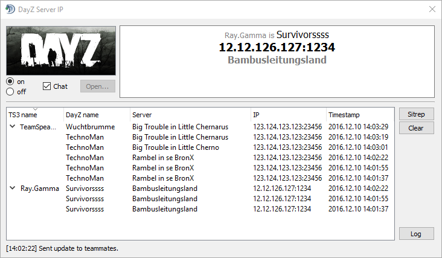

# DayZ Server IP - TS3 plugin

## About
This plugin can show and automatically distribute and update the IP and name of the server that you're playing on across all your teammates in your channel. No more need to type the IP into the chat yourself or to join via Steam's friendlist.

## Features
- Whenever you join a DayZ server, a message to your current TeamSpeak channel is sent. The plugin picks up on the message and updates its "player list" section (treeview in the lower half of the GUI).
- If you don't like or need the GUI, just close it. The plugin will keep running.
- The data in the "player list" section is saved to disk.

## Documentation
The [manual](doc/MANUAL.md) will get you up and running in a minute.  
For more documentation, take a look at the [overview](doc/README.md).

## Download
[DayZ Server IP](https://www.myteamspeak.com/addons/36985fae-1157-4be2-b807-93f72414105c
) has been submitted to [myTeamSpeak](https://www.myteamspeak.com) and is available directly from within your TeamSpeak Client's addon browser. If you do not want to use that service, check the [releases](https://github.com/dehesselle/dayzsrvip/releases) page.  
If you're only interested in the plain `.DLL`, download the `.ts3_plugin`, rename it to `.zip` and get it from there.

#### Requirements
Starting with v0.5, you need a 64bit version of TeamSpeak __3.1.x__ that provides plugin API v21. Older versions (e.g. 3.0.x) are no longer supported.

## Before you leave for Chernarus
This project is still in development. If you encounter any bugs, [report it](CONTRIBUTING.md#submitting-bug-reports) so I can take care of it.
