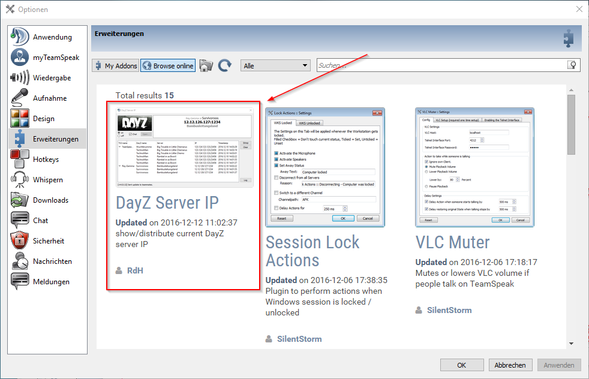
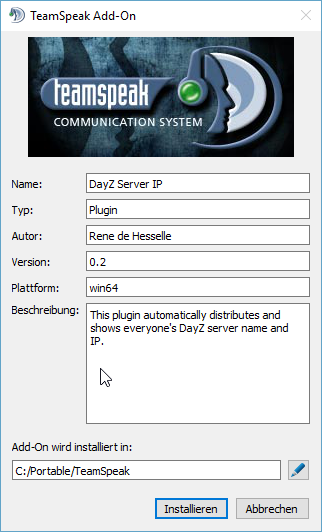
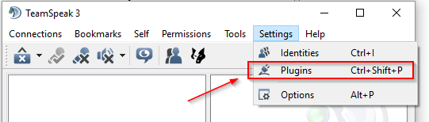
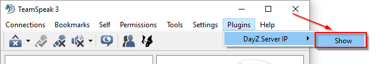
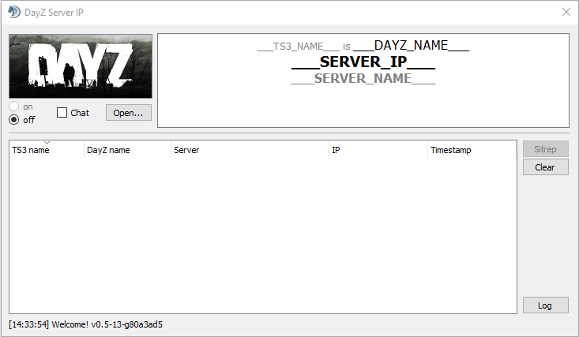
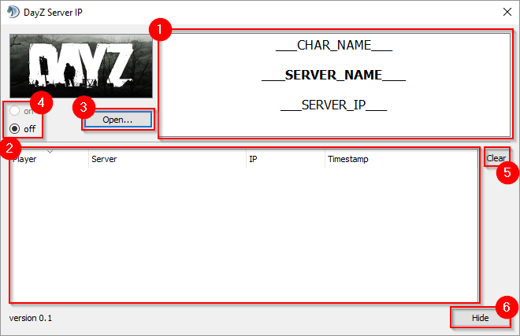

# TL;DR - quickstart
:information_source: __This is for the impatient ones - the detailed user guide is below!__

So you know your shit and don't want/need me to guide you through?  
Fine by me - let's go!

1. In your TeamSpeak client, go to `Tools`, `Options`, `Addons`. You can browse myTeamSpeak and install DayZ Server IP from there.
2. In your TeamSpeak client, go to `Plugins`, `DayZ Server IP` and click `Show`.
3. Click `Open...` to select your `.DayZProfile` file.
4. Join your TeamSpeak server and channel, then click `on`.
5. Have everybody else who you're going to play with go through steps 1-4.
6. Join a DayZ server.

# DayZ Server IP - user guide
Follow these few steps and you'll be up and running in a few minutes!

Just to make sure there's no misunderstanding: you and all your friends need to install and use this plugin, it doesn't work own its own!
(If it did, that would be real magic!)

## Install plugin
### automatic installation
Go to menu `Tools`, `Options` and `Addons` in your TeamSpeak client. You can browse online for plugins and there you should find [Dayz Server IP](https://www.myteamspeak.com/addons/36985fae-1157-4be2-b807-93f72414105c).

### manual installation
You can download the `.ts3_plugin` from either [myTeamSpeak](https://www.myteamspeak.com) or the [releases](https://github.com/dehesselle/dayzsrvip/releases) page here on GitHub. Double click it and the TeamSpeak Add-On installer will show up and do everything for you.

### _even more_ manual installation
If you don't like using installers at all, download the `.ts3_plugin`, rename it to `.zip` and put the contents of the extracted `plugins` folder into your TeamSpeak's `plugins` folder.
#### Enable plugin
After putting it in the `plugins` folder, start Teamspeak and go to `Settings`, `Plugins`...

...and enable it.

If the plugin doesn't show up there, you may need to click the `Reload All` button.

## Open plugin window
After having enabled the plugin it will show up in the `Plugins` menu. Since it runs in its own separate window, click on `DayZ Server IP`, `Show`.

This is what it looks like on its first start.

## Description

Most of the upper half of the window is the "player" section __(1)__. This is where your TS3 name, DayZ character name, server name and IP are shown. The lower half is the "player list" section __(2)__. It shows everybody else's TS3 name, DayZ character name etc. along with a timestamp to indicate when the last update was received.

The buttons __(3)__ and __(4)__ are to select your `.DayzProfile` file and to turn this thing on and off. `on` __(4)__ means that your data will be sent to other clients in your TeamSpeak channel. It's disabled until you have chosen a valid `.DayZProfile` with the `Open...` button __(3)__. While the plugin will remember your profile from now on, it'll always start in `off` mode __(4)__ on purpose.  
You cannot see the data that it transmitted between plugins. But you can enable the `Chat` checkbox to also send this data as text message to the channel's chat.

The "player list" section __(2)__ gets updated automatically whenever somebody joins a DayZ server. That also means that there won't be any updates in between, while everyone is playing. So if you're late to the party and everybody else has already joined a server, you'll have missed all those initial updates - and that's not good, is it? That's what the `Sitrep` button __(5)__ is there for. You can manually request a situation report from all other clients to get you updated.

The `Clear` button __(6)__ is hopefully self-explanatory, it gets rid of all the data in the "player list" __(2)__ section.

# How does this work?
It's not magic, that's for sure!

Whenever there are changes to your `.DayZProfile` file, the plugin gathers server IP, server name and character name from it and sends an internal (as in: invisible) message to your current channel in TeamSpeak. All clients with this plugin process this message and use it to update the "player list" __(2)__.

__No tricks__ are used; there is __no interference__ with BattlEye, VAC, ... whatever. But you don't need to take my word for it, the sourcecode is available for a reason.
